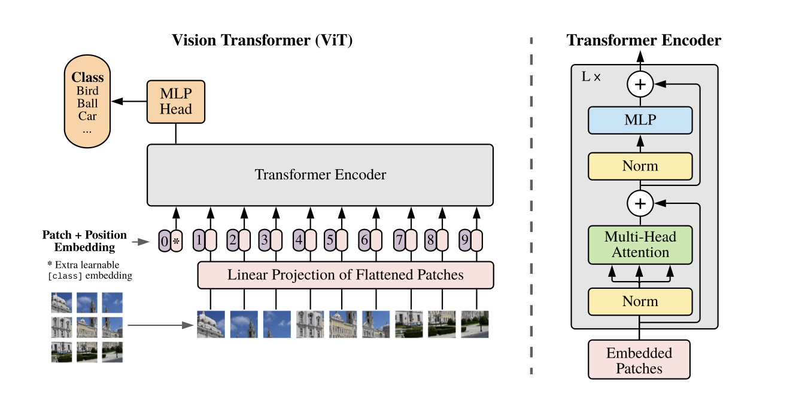
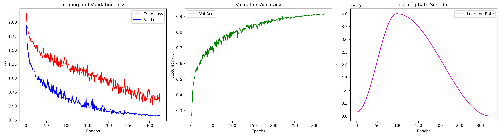
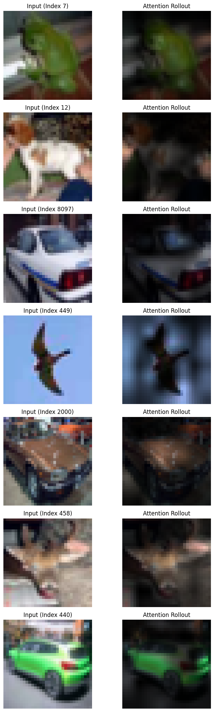

# mini-ViT
Re-implementing a Vision Transformer (ViT) from scratch in PyTorch. The architecture comes from the paper "An Image is Worth 16x16 Words: Transformers for Image Recognition at Scale."

The model follows the exact architecture defined in the paper including:
- patch embeddings with learable 1D positional encodings
- multi-head attention blocks w/ scaled dot-product attention
- a classification head used on a CLS token

Architecture diagram (from the paper):

## Implementation Details

My specific model configuration (9.6 million parameters) is as follows:
- Embedding dimension: 256
- 12 layers
- Number of attention heads per block: 4
- Patch size: 4x4

The model was trained on the CIFAR-10 dataset, which includes 50k training images of size 32x32. Due to the low resolution of the images in CIFAR-10, the patch size had to be reduced from the original 16x16 that is used in the paper. To prevent overfitting, CutMix and MixUp were used to make the classification problem significantly harder.

Training hyperparamters:
- AdamW (weight decay: 0.05, eps: 1e-8)
- OneCycleLR scheduler (max lr: 4e-3)
- batch size: 512
- epochs: 325
- CutMix & MixUp alpha: 0.2

## Results
Top-1 test accuracy: 91.52%

Train vs. Val loss, Validation Accuracy, Learning Rate graphs:

Note, the train loss is consistently higher than the validation loss because of the CutMix/MixUp augmentation, which is not present in the validation set.

## Interpretability

To get a better understanding of what is being attended to, I visualized the attention maps using attention rollout. The lighter areas indicate where the attention scores are higher. Similar visualizations were used in the original paper.

